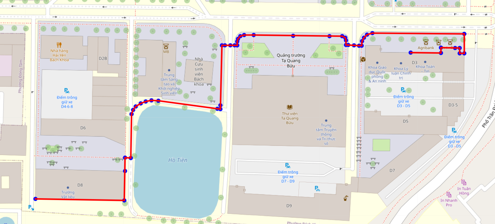

# HUST Map Shortest Path and Closest Parking Lot Finder
This is a Python web application that allows users to:
Find the shortest path between two locations on the Hanoi University of Science and Technology (HUST) map.

Locate the nearest parking lot using Dijkstra’s algorithm.

## Requirements
Python 3.x installed on your machine

A web browser (e.g., Chrome)

A code editor like VS Code (optional but recommended)

Local environment capable of running a Flask server

## How to Run
### Step 1: Clone the repository
- git clone https://github.com/knguyenz/hustnav1

- cd hustnav1

- changing the path in app.py (sorry for the inconvenience as we used absolute path)

### Step 2: Install required libraries
- pip install -r requirements.txt

### Step 3: Run Flask server
- cd backend
- python app.py

The Flask app will run at http://localhost:5000

The generated map will be saved at: backend/save/map.html

## Using the App
Open your browser and go to:
http://localhost:5000

Enter the starting location (e.g., C7) and the destination (e.g., D8), then click "Tìm đường" (Find route).

Open the /map tab to view the generated route:

http://localhost:5000/map

## To Find the Nearest Parking Lot
Enter only the starting location.

Click "Tìm nhà xe gần nhất" (Find nearest parking).

Go to the /map.html tab to view the route to the nearest parking lot.

## Notes on File Paths
In app.py, make sure to replace all hardcoded file paths (such as for .osm, .json, .html) with the correct paths on your local machine. You can find the exact locations using File Explorer.

## Test case 

### Finding the shortest path between 2 locations

### Finding the nearest parking lot

## Authors
This project was developed by Group 5 from the Data Structures & Algorithms course at Hanoi University of Science and Technology (HUST):

#### Phan Khôi Nguyên

#### Lê Bá Nhật Nguyên

#### Đào Nguyên Minh Vũ